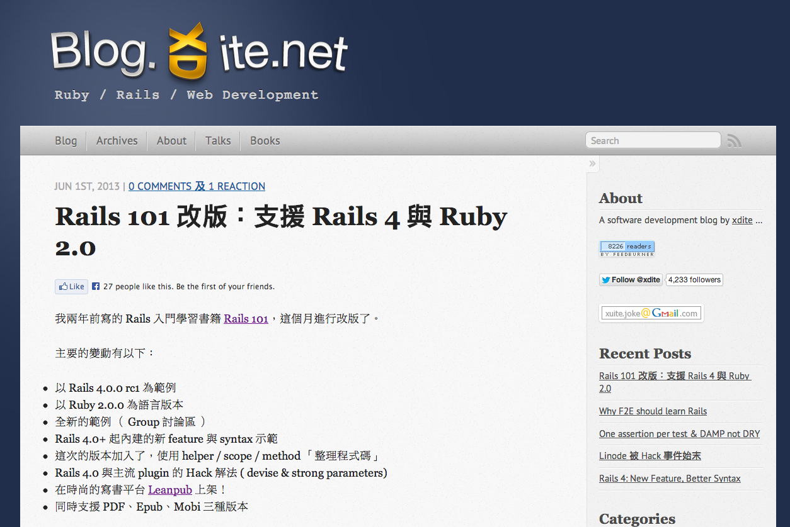
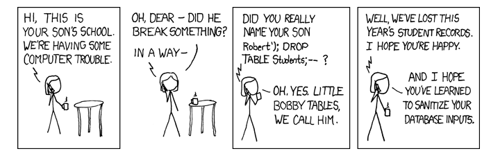
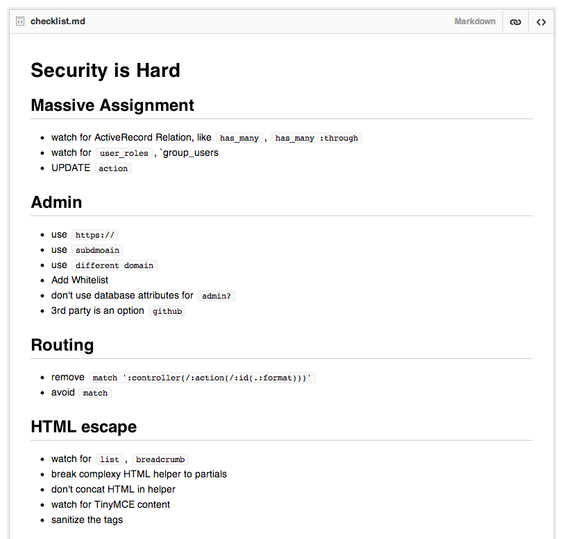

---

layout: default

style: |

    #Cover h2 {
        margin:65px 0 0;
        font-size:70px;
        text-align: center;
        }
    #Cover h3 {
        margin-top: 30px;
        position: static;
        }
    #Cover p {
        margin:10px 0 0;
        text-align:center;
        font-style:italic;
        font-size:20px;
        }
    #Picture h2 {
        color:#FFF;
        }
    #SeeMore h2 {
        font-size:100px
        }
    #SeeMore img {
        width:0.72em;
        height:0.72em;
        }
    #live-demo h2,
    #live-demo .note,
    #by-home h2,
    #welcome-together h2 {
        background-color: rgba(0,0,0,.7);
        color: #fff;
        display: inline-block;
        padding: 0.5em;
        }
    .highlight{
        color: red;
    }

    #anonymous{
        background: black;
    }
    #xkcd-327 img{
       padding-top: 120px;
    }

    .shout.with-picture img {
        max-height: 60%;
        margin: 0 auto;
        display: block;
    }
    .shout.with-picture h2 {
        font-size: 120px;
        -webkit-transform: translateY(75%);
        -moz-transform: translateY(75%);
        transform: translateY(75%);
        }
    .shout.medium h2{
       font-size: 70px;
    }
    .shout.medium.with-picture h2 {
        -webkit-transform: translateY(175%);
        -moz-transform: translateY(175%);
        transform: translateY(175%);
        }

    .slide, .slide.shout {
        background: #fff url(pictures/logo-tint.png) no-repeat 95% 90%;
        background-size: 150px;
        }
    .slide h2, .slide h3 {
        color: #444;
        }
    .slide h3 {
        width: 100%;
        font-size: 150%;
        text-align: center;
        position: absolute;
        left: 0;
        bottom: 30%;
        }
    .slide.with-subtitle h2 {
        -webkit-transform: translateY(-85%);
        -moz-transform: translateY(-85%);
        transform: translateY(-85%);
    }
    .left{
        text-algin: left;
    }
    .footnote {
        font-size: 75%;
        position: absolute;
        bottom: 0;
        }
    code{
        font-size : 0.8em;
        line-height: 18px;
    }

    .code.smaller code{
        font-size: 0.6em;
        line-height: 18px;
        margin-top: 10px;
    }
    .code p{
        margin-bottom: 10px;
    }
---

# Secure Your Rails Application {#Cover}

<h3>The Basics</h3>

*xdite xdite@rocodev.com*

{:.shout.with-picture}
## xdite

{:.shout.with-picture.medium}
## Top #1 Rails Blog in Chinese

{:.shout .medium .small}
## Rocodev @ Taiwan

{:.shout .medium}
## Secure Your Rails Application

{:.shout .medium}
## Rails security

{:.shout .medium}
## XSS    SQL injection     Phishing...

{:.shout.with-picture#anonymous}
## From Hacker's view

## Overview

* Common vulnerability of application design
* The solutions
* Write secure codes by default

{:.shout .medium .with-subtitle}
## Is Rails safe?

{:.shout .medium .with-subtitle}
## Rails is (relatively) SAFE

### compare to other web frameworks

{:.shout .medium}
##Secure by default

{:.shout .medium .with-subtitle}
##HTML Escape

### XSS attack

{:.footnote.note}
Since Rails 3.0+

{:.shout .medium .with-subtitle}
##SQL Escape

### SQL injection

{:.footnote.note}
(from the beginning)

{:.shout .medium .with-subtitle}
##Authenticity Token

### Cross Site Request Forgery

{:.footnote.note}
(from the beginning)

{:.shout .medium .with-subtitle}
##Exception Page

### ( stupid PHP debug mode ) 

{:.footnote.note}
(from the beginning)

{:.shout .medium .with-subtitle}
##Password Encrypted 

### plaintext password

{:.footnote.note}
(default by 99% Rails auth gem)

{:.shout .medium .with-subtitle}
##Sensitive data filtered from log

### password from log

{:.footnote.note}
(from the beginning)

{:.shout .medium .with-subtitle}
## Filename  Sanitization

### path attack

{:.footnote.note}
(default by popular Rails gem)

{:.shout .medium}
##PHP way won’t work in Rails

{:.shout .medium}
## But ... is Rails safe from hacker?

{:.shout .medium}
## ...probably not.

{:.shout .medium}
## Rails is a FRAMEWORK

{:.shout .medium}
## it has hackable patterns

{:.shout .medium}
## <del>framework's defeat</del>

{:.shout .medium}
## hackers target developer's mistakers

{:.shout .medium}
## COMMON mistakes

{:.shout .medium}
## #1. massive assignment

## Background

### Rails provide effective way to design forms

    <%= f.text_field :title %>
    <%= f.text_field :body %>

## Background

### Rails provide effective way to design forms

    <input id="topic_title" name="topic[title]" size="30" type="text">
    <input id="topic_body" name="topic[body]" size="30" type="text">

## If ....

    <input id="topic_title" name="topic[title]" size="30" type="text">
    <input id="topic_body" name="topic[body]" size="30" type="text">
    <input id="topic_user_id" name="topic[user_id]" size="30" type="text">

`topic[user_id]`

Fake DOM in Chrome Inspector

{:.code .smaller}
## Most controller 

    class TopicsController < ApplicationController
    
       def edit
         @topic = Topic.find(params[:id])
         if @topic.update_attributes(params[:topic])
                   ^^^^^^^^^^^^^^^^^^^^^^^^^^^^^^^^^
           redirect_to topic_path(@topic)
         else
           render :edit
         end
        
       end
    end

{:.shout .medium}
## role_ids

## Or

    class User < ActiveRecord::Base
      has_many :roles
    end

### `role_ids` => Getter / Setter

## Hack this way

    <input id="user_title" name="user[title]" size="30" type="text">
    <input id="user_body" name="user[body]" size="30" type="text">
    <input id="user_role_ids" name="user[role_ids]" size="30" type="text">

{:.shout .medium .with-subtitle}

## Where to look : 

* `has_many`, `has_many :though` involve OWNERSHIP, Permission
* `user_roles`, `group_users`, ....
* `UPDATE` action

## Possible Solutions

#### whitelist attribute ( remove in Rails 4)

* `config.active_record.whitelist_attributes = true` 
* `attr_protected :roles`

## Recommended solutions

#### Strong parameters (in Rails 4)

* `params.require(:topic).permit(:title, :body)`

{:.code .smaller}
## Advanced Solution

#### Reform

* https://github.com/apotonick/reform
* Decouple your models from forms
* gives you a form object with validations and nested setup of models.
* also by apotonick, the author of Cells

## Advanced Solution

    def create
      @form = SongRequestForm.new(song: Song.new, artist: Artist.new)
    
      if @form.validate(params[:song_request])
         ....

{:.code .smaller}
## Advanced Solution

    require 'reform/rails'
    
    class UserProfileForm < Reform::Form
      include DSL
      include Reform::Form::ActiveRecord
    
      property :email,        on: :user
    
      model :user
    
      validates :email, presence: true
    end

{:.shout .medium}
## #2. admin

{:.shout .medium}
## http://example.org/admin

###  99%

## Vulnerability 

* easy to guess
* easy attacked by XSS

## Basic Solution

* http://`admin`.example.org
* http://admin.example.`net`
* `https://`admin.example.org
* `https://stop-here.myapp.in`

## Basic Solution

* Intranet ( invisible from Internet )
* WiteList.contains?(request.remote_ip)
* Break to another Admin App

{:.shout .medium}
## def admin?; is_admin; end

## Basic Solution

* `Setting.admin_emails.include?(email)` not that obvious
* `warden-github-rails` 3rd party authoration

{:.shout .medium}
## #3. bypass RESTful

## Reason

* Some developer `HATE` RESTful
* Some developer `don’t understand` RESTful
* Some developer `don’t think it’s necessary` to use RESTful * all the time.

## But..

* Rails provide CSRF protection by default
* works you use RESTful design
* HTTP 422 for invalid request

{:.code .smaller}
## Vulnerability 

#### Rails even provide conveninent example!!

    # config/routes.rb 

   
    # This is a legacy wild controller route that's not recommended for   RESTful applications.
    # Note: This route will make all actions in every controller  accessible via GET requests.

`match ':controller(/:action(/:id(.:format)))'`

## Possible solutons

* remove `match ':controller(/:action(/:id(.:format)))'`
* set coding policy for routing
* non-RESTful example REMOVED in Rails4

{:.shout .medium}
## #4. match in routing

## Background

* `match` matches all HTTP verb
* `match '/article/delete/:id', :to => "articles#destroy" :as => "delete_article"`
* it allow using GET to massive delete articles

## Where to look

* check `non-RESTful` routing
* `match` is bad smell

{:.code .smaller}
## Solution

#### 1. refactor to RESTful

#### 2. using right verb : get, post, put , delete

`delete '/article/delete/:id', :to => "articles#destroy" :as => "delete_article"`

#### 3. add via

`match '/article/delete/:id', :to => "articles#destroy" :as => "delete_article", :via => :delete `

{:.shout .medium}
## #5. bypass HTML Escape

## Safe Buffer

#### Rails provide html escape by default

    // SAFE
    def render_post_title(post)
      link_to(post.title, post_path(post))
    end

{:.code .smaller}
## Complex helper

#### Easy happened on `list`, `breadcrumb`..etc.

    // UNSAFE
    def render_post_title(post)
      str = “”
      str += “<li>”
      str += link_to(post.title, post_path(post))
      str += “</li>”
      return raw(str)
             ^^^^^^^^  // unescape...orz
    end

## Where to look

#### Bad Smell

* `raw(str)`
* `.html_safe`

#### might be vulnerable

* `Complex decorated DOM`, such as `category in list`, `post title in breadcrumb`, `user name with glyphicons`

{:.code .smaller}
## Basic Solution

#### Break into partials

    // SAFE
    def render_post_title(post)
      render :partial => "posts/title_for_helper", :locals => { :title => post.title }
    end

## 5.1 TinyMCE on UGC

* allow user to manipulate DOM
* `img`, `table`, `tbody`, `div`, `span`, ...

{:.code .smaller}
## Basic Solution

#### sanitize the tags

    def s(html)
      sanitize( html, :tags => %w(table thead tbody tr td th ol ul li div span font
       img sup sub br hr a pre p h1 h2 h3 h4 h5 h6), 
       :attributes => %w(style src href size color) )
    end

{:.shout .medium}
## #6.bypass SQL escape

{:.shout.with-picture#xkcd-327}
## &nbsp;

## SQL escape in ORM by default

    // SAFE
    User.where([“name LIKE?”, params[:q])

## But...

    // UNSAFE
    User.find_by_sql("name LIKE &rsquo;%#{params[:q]}%&rsquo;")

### People like drop plain SQL

{:.code .smaller}
## Or

    // UNSAFE
    User.where(“email = ‘#{params[:email]}’”).first
    // won’t escape

`SLELECT “users”.* From “users” WHERE (email = ‘’ OR ‘1’) LIMIT 1`

They just don’t know how to use “where” in right ways.

## Where to look

* `Search` Functions
* actions with `complex options `, ex. date, : order, : field
* actions with `complex joins`
* `find_by_sql`, `count_by_sql`

## Basic Solution

* use simple search solution like `ransack` instead
* avoid any `find_by_sql`, `count_by_sql`

{:.shout .medium}
## http://rails-sqli.org/

{:.shout .medium}
## #7. same secret token

{:.shout .medium .with-subtitle}
## secret_token.rb 

### to verify signed cookies.

## But...

* People always forgot to run `rake secrect` to regenerate new key after cloning a Rails new project.
* People always puts their token in public github repo ...
* google:// secret_token.rb site:github.com 

## Where to look & Solution

* if fork from `OPEN SOURCE` project, remove `secret_token.rb`, run `rake secrect`
* if you are `OPEN SOURCE` project, SET token in `ENV['SECRET_TOKEN']`
* Redmine set `.gitignore`
* discources set in ` ENV['SECRET_TOKEN']`

{:.shout .medium}
## #8. scopes

{:.code .smaller}
## EDIT action 

    // UNSFAE  
    class TopicsController < ApplicationController

      before_filter :login_required
      before_filter :check_permission, :only => [:edit]

      def edit
        @topic = Post.find(params[:id])
      end
    end

{:.code .smaller}
## EDIT action 

    // SAFE
    class TopicsController < ApplicationController
      before_filter :login_required
      def edit
        @topic = current_user.posts.find(params[:id])
      end
    end
    
## Where to look & Solution

* `EDIT`, `UPDATE`, `DESTROY` action
* using scopes filter out ( `current_user.posts` ) as `404 Not Found`
* Using `cancan` to authourize resources ( complex permission )

{:.shout .medium}
## # 9. Upgrades

{:.shout .medium }
## Remote Code Execution

{:.cover}
## &nbsp;

{:.footnote.note}
Wallpaper from [“wallpaperstock.net”](http://wallpaperstock.net/nuke-cloud_wallpapers_12631_1024x768_1.html)

{:.shout .medium }
## Upgrade to `3.2.11+`

{:.shout .medium }
## Summary

{:.shout .medium }
## Security is Hard

{:.shout .medium .with-picture}
## https://gist.github.com/5618045 

## Thanks
{:.shout}

