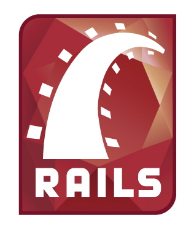

---

layout: default

style: |

    #Cover h2 {
        margin:65px 0 0;
        font-size:70px;
        text-align: center;
        }
    #Cover h3 {
        margin-top: 30px;
        position: static;
        }
    #Cover p {
        margin:10px 0 0;
        text-align:center;
        font-style:italic;
        font-size:20px;
        }
    #Picture h2 {
        color:#FFF;
        }
    #SeeMore h2 {
        font-size:100px
        }
    #SeeMore img {
        width:0.72em;
        height:0.72em;
        }
    #live-demo h2,
    #live-demo .note,
    #by-home h2,
    #welcome-together h2 {
        background-color: rgba(0,0,0,.7);
        color: #fff;
        display: inline-block;
        padding: 0.5em;
        }
    .highlight{
        color: red;
    }

    .shout.with-picture img {
        max-height: 60%;
        margin: 0 auto;
        display: block;
    }
    .shout.with-picture h2 {
        font-size: 120px;
        -webkit-transform: translateY(75%);
        -moz-transform: translateY(75%);
        transform: translateY(75%);
        }
    .shout.medium h2{
       font-size: 70px;
    }
    .shout.medium.with-picture h2 {
        -webkit-transform: translateY(175%);
        -moz-transform: translateY(175%);
        transform: translateY(175%);
        }

    .slide, .slide.shout {
        background: #fff url(pictures/logo-tint.png) no-repeat 95% 90%;
        background-size: 150px;
        }
    .slide h2, .slide h3 {
        color: #444;
        }
    .slide h3 {
        width: 100%;
        font-size: 150%;
        text-align: center;
        position: absolute;
        left: 0;
        bottom: 30%;
        }
    .slide.with-subtitle h2 {
        -webkit-transform: translateY(-85%);
        -moz-transform: translateY(-85%);
        transform: translateY(-85%);
    }
    .left{
        text-algin: left;
    }
    .footnote {
        font-size: 75%;
        position: absolute;
        bottom: 0;
        }
---

# Why F2E should learn Rails? {#Cover}

<h3>你所不知道的 Rails 前端優勢</h3>

*xdite xdite@rocodev.com*

## **Hi**

{:.shout.with-picture}
## xdite

{:.shout.with-picture}
## Ruby on Rails

{:.cover}
## &nbsp;

{:.footnote.note}
Poster from movie [“Fulltime Killer”](http://www.imdb.com/media/rm2355469568/tt0286635)

## **兩個重點**

// 本場只有兩個重點：

{:.shout .medium .with-subtitle}
## Best Practicss for  Speeding Up Your Website

### 最佳實踐

## Asset Pipeline
{:.shout .medium}

## http://xdite.github.io/jsdc-2013-slide/
{:.shout .medium}

## 在 JSDC 講 Rails ?
{:.shout .medium}

// 相信很多人對我挑這個題目來講，一定覺得很奇怪。

## 明明 node.js 比較快
{:.shout .medium}

## 速度比較表

<table style="border:1px #000000 solid; padding:2px; text-align:center;" width="90%">
    <tr>
        <td width="37%"> Web 框架 </td>
        <td width="35%"> 併發模型 </td>
        <td width="45%"> 531 req / s </td>
    </tr>

    <tr>
        <td> Rails  </td>
        <td> Multiple Process </td>
        <td> 531 req / s  </td>
    </tr>

    <tr>
        <td> Sinatra  </td>
        <td> Multiple Process </td>
        <td> 576 req / s  </td>
    </tr>

    <tr>
        <td> Sinatra::Synchrony </td>
        <td> Fibers </td>
        <td> 1692 req / s  </td>
    </tr>

    <tr>
        <td> Goliath </td>
        <td> Fibers </td>
        <td> 1924 req / s  </td>
    </tr>

    <tr>
        <td> Cramp </td>
        <td> Event IO  </td>
        <td> 3516 req / s  </td>
    </tr>
    <tr>
        <td> Node.js </td>
        <td> Event IO </td>
        <td class="highlight"> 3100 req / s </td>
    </tr>
</table>

## node.js 比 Rails 快了 6 倍
{:.shout .medium}

## 那...
{:.shout .medium}

// 那...為什麼還要講這個題目？

## 現場調查
{:.shout}

## Best Practicss for  Speeding Up Your Website
{:.shout .medium}

## 速度比較表

<table style="border:1px #000000 solid; padding:2px; text-align:center;" width="90%">
    <tr>
        <td width="37%"> Web 框架 </td>
        <td width="35%"> 併發模型 </td>
        <td width="45%"> 531 req / s </td>
    </tr>

    <tr>
        <td> Rails  </td>
        <td> Multiple Process </td>
        <td> 531 req / s  </td>
    </tr>

    <tr>
        <td> Sinatra  </td>
        <td> Multiple Process </td>
        <td> 576 req / s  </td>
    </tr>

    <tr>
        <td> Sinatra::Synchrony </td>
        <td> Fibers </td>
        <td> 1692 req / s  </td>
    </tr>

    <tr>
        <td> Goliath </td>
        <td> Fibers </td>
        <td> 1924 req / s  </td>
    </tr>

    <tr>
        <td> Cramp </td>
        <td> Event IO  </td>
        <td> 3516 req / s  </td>
    </tr>
    <tr>
        <td> Node.js </td>
        <td> Event IO </td>
        <td class="highlight"> 3100 req / s </td>
    </tr>
</table>

## 這張表講的是    「網頁產生速度」
{:.shout .medium}

## 回到正題
{:.shout}

## Scaling Websites
{:.shout}

## Priciples

* Front-end speed
* SQL Query speed
* Method speed
* Programing Language speed

##  Front-end performance
{:.shout .medium}

##  7s -> 1s
{:.shout}

##  SQL Query Performance
{:.shout .medium}

##  500ms -> 50ms
{:.shout}

##  Method Performance
{:.shout .medium}

##  50ms -> 10ms
{:.shout}

##  Programming Language Performance
{:.shout .medium}

##  5ms -> 2ms
{:.shout}

##  Webpage 產生速度 =    SQL Query speed +    Method speed +    Programing Language speed
{:.shout .medium .left}

## 比較語言和框架本身的速度沒什麼意義

* node.js V.S. Rails
* Rails V.S. Sinatra
* Rails V.S. PHP...

{:.cover}
## 能夠壓榨出來的時間

##  What can Rails do ?
{:.shout .medium}

## Speed Frontend Performance by default
{:.shout .medium}

## (1)   Parallel Download
{:.shout .medium}

## Easy to apply Parallel Download

The `HTTP/1.1` specification suggests that browsers download **no more than 2 components** in parallel per hostname. If you serve your images from `multiple hostnames`, you can get more than two downloads to occur in parallel.

## Easy to imeplement parallel download

    config.action_controller.asset_host =
        "http://asset%d.example.com"

    
    
    
    

## 4 支 CSS 開 8 秒 => 4 支開 2  秒
{:.shout .medium}

## (2)   CDN
{:.shout .medium}

## 加速下載
{:.shout .medium}

## 擋台灣鋤頭鄉民
{:.shout .medium}

## Easy to apply CDN

A content delivery network or `content distribution network (CDN)` is a large distributed system of servers deployed in multiple data centers across the Internet. The goal of a CDN is to serve content to end-users with **high availability and high performance**.

## Easy to imeplement parallel download

    config.action_controller.asset_host =
        "http://cdn%d.example.com"

    
    
    
    

## CDN invalid 問題

    <link href="/assets/application.css" type="text/css" />

## CDN invalid 問題

    <link href="/assets/application-v1.css" type="text/css" />
    <link href="/assets/application-v2.css" type="text/css" />
    <link href="/assets/application-v3.css" type="text/css" />

## Based on `TIMESTAMP`, auto INVALID

    <link href="/assets/application-1b7a795f9.css" type="text/css" />
    <link href="/assets/application-ca29aba87.css" type="text/css" />
    <link href="/assets/application-72ae3ec5b.css" type="text/css" />

## (3)  minimal HTTP Request
{:.shout .medium}

## Too many CSS

    <link href="/assets/bootstrap.css" type="text/css" />
    <link href="/assets/my-homepage.css" type="text/css" />
    <link href="/assets/user-account.css" type="text/css" />

## application.css

    //= require_self
    //= require bootstrap
    //= require my-homepage
    //= require user-account.css
    //= require jquery.fullcalendar

## minimal HTTP Request

* Pack
* Gzip
* Trim
* Uglify

## application.css

    <link href="/assets/application-1b7a795f9.css" type="text/css" />

## (4)  CSS Sprite
{:.shout .medium}

## 把幾十張小圖打包成一張
{:.shout .medium .with-picture}

## Powered by `SCSS` & `Compass`

    @import "icon/*.png";

    $icon-sprite-dimensions: true;
    @include all-icon-sprites;

## (5)  ETag
{:.shout .medium}

## Auto ETag

`ETag` , is part of HTTP, the protocol for the World Wide Web. It is one of several mechanisms that HTTP provides for **web cache validation**, and which allows a client to make conditional requests. This allows caches to be more efficient, and saves bandwidth, as a web server does **not need to send a full response if the content has not changed**.

## Auto ETag

    # lib/rack/etag.rb
    def call(env)
      status, headers, body = @app.call(env)
      parts = []
      body.each { |part| parts << part.to_s }
      headers['ETag'] = %("#{Digest::MD5.hexdigest(parts.join(""))}")
      [status, headers, parts]
    end

## 通通第一天就內建
{:.shout .medium}

## That's why you should use Rails
{:.shout .medium}

## Rails 還能作什麼？
{:.shout .medium}

{:.shout .medium .with-picture}
## Package Management

## Framework 升級的痛

    rm -rf boostrap-2.2
    cp -rf ~/Downloads/bootstrap bootstrap-2.3

## Gemfile

    gem "jquery"
    gem "font-awesome"
    gem "tinymce-rails"
    gem "bootstrap-rails", "2.2.0"

## Upgrade Asset

    gem "jquery"
    gem "font-awesome"
    gem "tinymce-rails"
    gem "bootstrap-rails", "2.3.0"

## Benefit

* 不會弄髒 Git history
* easy upgrade
* dependency

## Directory Management
{:.shout .medium}

## (A) by controller
{:.shout .medium}

## 寫在一支 CSS 裡

    .article h2  { font-size: 20px;}
    .user .name { font-weight: bold; }
    .comment p { line-height: 1.2em; }

## 寫在以 controller 命名的 CSS 裡

    //= require article
    //= require user
    //= require comment

## (B) by function
{:.shout .medium}

## 傳統收納方式（等於沒有收納）

* css/boostrap-2.3.css
* css/color-picker.css
* css/jquery-ui.css
* css/jquery-calendar.css
* css/my-home.css
* css/social-share.css

## 目錄結構

* app/assets # application 專用 assets
* lib/assets # 常用系統 library
* vendor/assets # 第三方 assets , 如 jQuery plugin

## 傳統收納方式

* css/boostrap-2.3.css
* css/color-picker.css
* css/jquery-ui.css
* css/jquery-calendar.css
* css/my-home.css
* css/social-share.css

## 改良後的收納方式

* `vendor/styelseets/`boostrap-2.3.css
* vendor/styelseets/color-picker.css
* vendor/styelseets/jquery-ui.css
* `vendor/styelseets/jquery-calendar.css
* `app/styelseets/`my-home.css
* `lib/styelseets/`social-share.css

## Bootstrap 綜合密技 
{:.shout .medium}

## Bootstrap Hack (1)

    //= require bootstrap-wrapper
    //= require awesome-bootstrap-theme
    //= require awesome-bootstrap-theme-override

## Bootstrap Hack (2)

    @import "bootstrap-setting";
    @import "twitter/bootstrap/variables";
    @import "bootstrap-override";

## Bootstrap Hack (3)

    // puts your override variable here
    // $baseFontSize:  13px;
    // $navbarHeight:  50px;

    $navbarInverseLinkColor: #ddd;
    $navbarInverseBackground: #222;
    $navbarInverseBackgroundHighlight: #610403;

{:.shout .medium .with-picture}
## 制服

{:.shout .medium .with-picture}
## Flat Style ~

## And there's more in Rails 4
{:.shout .medium}

## Live Streaming
{:.shout}

## Turbolinks
{:.shout}

## 總結
{:.shout .medium}

## 寫程式是為了讓自己  能夠生活得更快樂
{:.shout .medium}

{:.cover}
## &nbsp;

{:.cover#by-home}
## 我先下班了～

{:.cover#welcome-together}
## 歡迎一起學習 Rails！

## Some Links

* http://blog.xdite.net
* http://blog.rocodev.com
* http://www.meetup.com/taipei-rails-meetup/

## Rails 101 新版 
{:.shout .medium .with-picture}

## http://leanpub.com/rails-101    Ruby 2.0.0 + Rails 4.0    JSDC2013 ($5 USD coupon) 
{:.shout .medium}

## 另外一本
{:.shout .medium}

## http://leanpub.com/rails-fnd     Rails Fronend Practices    Coming Soon...
{:.shout .medium}

## Thanks
{:.shout}

